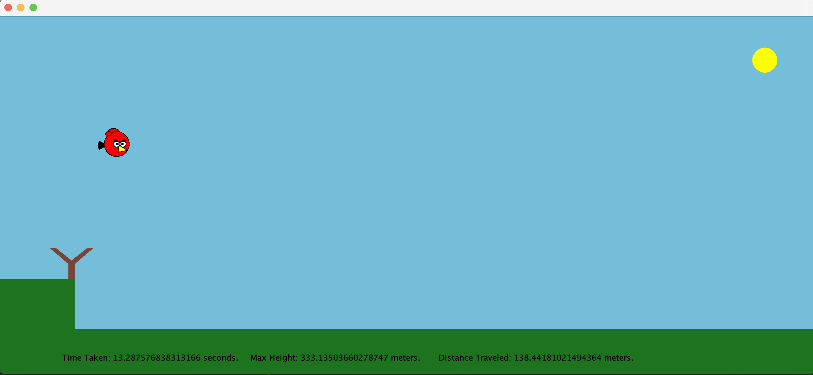

# Angry Bird Projectile Motion
A projectile-motion simulator in Java, illustrated using a built-in Java Graphics library.

## Functionality and Graphics
Built using Javax.swing.JFrame, which allows for ease of illustrating the bird and graphics.
This program simulates the path of motion of an "angry bird" with inputted initial conditions, in the absence of air resistance and other energy losses.

The program prompts for the initial height of the cliff (in meters), degree of launch, and initial velocity of our "Angry Bird" (in m/s)
The program then demonstrates the motion of the bird in real-time, as well as displaying various measurements of the travel.

<b>Measurements Recorded at the Bottom of the Screen:</b>

- <i>Time Taken</i>
- <i>Maximum Height</i>
- <i>Horizontal Distance Traveled</i>

## In-Action

<i> Angry Bird in motion with intial conditions: Height: 80m; Degree: 80; Initial Velocity: 60m/s.
